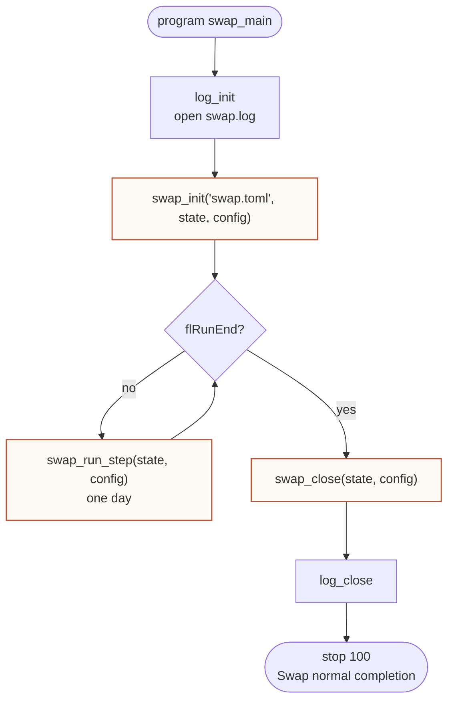
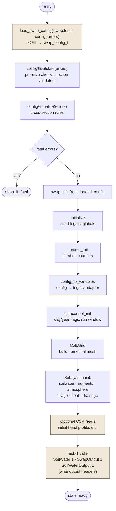
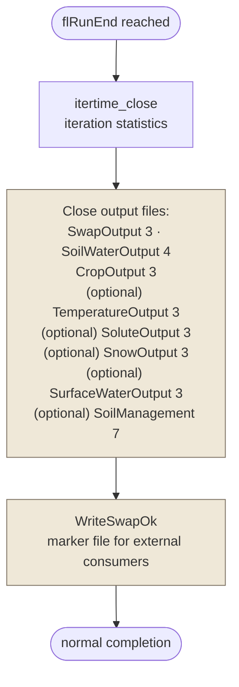

# Execution flow

This page traces a SWAP run from process start to termination, showing
the order in which the major subroutines fire. The model is structured
as a thin driver (`src/core/swap_main.f90`) that calls a three-phase
entry point exposed by `src/core/swap_mod.f90` — `swap_init`,
`swap_run_step`, and `swap_close` — with all simulation data carried in
the `state` and `config` containers between calls.

The same module is consumed by the BMI shim (`src/core/swap_bmi_mod.f90`)
which advances one timestep at a time from a host program; the driver
below just wraps `swap_run_step` in a `do while (.not. flRunEnd)` loop.

## High-level lifecycle

The three phase calls (`swap_init`, `swap_run_step`, `swap_close`)
are highlighted: those are the entry points; everything else is either
driver scaffolding or single-purpose plumbing.

## `swap_init` — one-time setup

Anything that involves file I/O or output-file headers is muted; the
rest are pure in-memory init steps. Note that `swap_init` does NOT read
meteo — that happens on demand inside `swap_run_step` (year/day-start
guards).

## `swap_run_step` — one simulation day

```mermaid
flowchart TD
    Day([day starts]) --> YS{flYearStart?}
    YS -- yes --> RYM[ReadMeteoYear]
    YS -- no --> DS{flDayStart?}
    RYM --> DS
    DS -- yes --> DayHead["ReadMeteoDay<br/>CropGrowth 1 · check season<br/>irrigation 2<br/>ProcessMeteoDay<br/>DoTillage 2"]
    DS -- no --> Snow{flSnow & flDayStart?}
    DayHead --> Snow
    Snow -- yes --> SnowStep[snow_step]
    Snow -- no --> Frost{swfrost=1?}
    SnowStep --> Frost
    Frost -- yes --> FC[FrozenCond]
    Frost -- no --> Roots[RootExtraction]
    FC --> Roots
    Roots --> BB["BoundBottom<br/>bottom boundary condition"]
    BB --> SubLoop{adaptive<br/>sub-timestep loop}

    SubLoop -- iterate --> Sub["Drainage<br/>SurfaceWater 2<br/>SoilWater 2 · Richards solver<br/>SurfaceWater 3<br/>if non-convergence: reduce Δt, retry"]
    Sub --> SubLoop
    SubLoop -- converged --> SW3[SoilWater 3 · rate & state]
    SW3 --> T2{flTemperature?}
    T2 -- yes --> Temp[Temperature 2]
    T2 -- no --> Sol{flSolute?}
    Temp --> Sol
    Sol -- yes --> SolSub[Solute 2]
    Sol -- no --> Adv[timecontrol_advance]
    SolSub --> Adv
    Adv --> DE{flDayEnd?}
    DE -- yes --> EndDay["SoilManagement 2,5,3,4,6<br/>CropGrowth 2 · potential growth<br/>CropGrowth 3 · actual growth<br/>CropGrowth 4 · harvest<br/>timecontrol_day_end"]
    DE -- no --> Out{flOutput?}
    EndDay --> Out
    Out -- yes --> Write["SwapOutput 2 · SoilWaterOutput 2<br/>TemperatureOutput · SoluteOutput<br/>SnowOutput · SurfaceWaterOutput<br/>CropOutput · DoTillage 3"]
    Out -- no --> Done([day done])
    Write --> Done

    classDef io fill:#efe8d8,stroke:#7a6f60;
    classDef solver fill:#fdfaf3,stroke:#b85535,stroke-width:1.5px;
    class RYM,DayHead,Write io;
    class Sub,SW3 solver;
```

A few things worth knowing:

- **Two cadences**: agronomy (meteo, crop, irrigation, tillage, soil
  management) runs once per calendar day, gated by `flDayStart` /
  `flDayEnd`. The water solver and friends run on an adaptive sub-daily
  Δt, looping as many times as needed for Richards convergence.
- **`SoilWater(task, …)`** is called with three task codes: 1 (init,
  inside `swap_init`), 2 (rate evaluation inside the inner loop), 3
  (state update after the loop converges). Same convention for
  `SurfaceWater`, `Drainage`, `Solute`, `Temperature`.
- **Δt reduction** lives in the inner `do while (fldtreduce)` loop. If
  `SoilWater 2` (or `SurfaceWater 2/3`) sets `fldecdt`, the loop calls
  `SoilWaterStateVar(2)` + `timecontrol_reduce_dt`, then re-iterates
  with the smaller step.
- **Output is opt-in per day**: `flOutput` is set by the timecontrol
  module based on the output schedule in `swap.toml`. Short-output
  days bypass the full block.

## `swap_close` — teardown

`swap_close` is short on purpose: per-subsystem cleanup is the job
of each subsystem's `task=3` (or `task=4`) call. The driver only
coordinates closing order and writes the `<project>.ok` marker file
that external test harnesses watch for.

## Source map

| Phase | File | Subroutine |
|---|---|---|
| Driver | `src/core/swap_main.f90` | `program swap_main` |
| Init | `src/core/swap_mod.f90:19` | `swap_init` |
| Init (post-config) | `src/core/swap_mod.f90:53` | `swap_init_from_loaded_config` |
| Step | `src/core/swap_mod.f90:430` | `swap_run_step` |
| Close | `src/core/swap_mod.f90:639` | `swap_close` |
| BMI shim | `src/core/swap_bmi_mod.f90` | `bmi_initialize` / `bmi_update` / `bmi_finalize` |

For the lifecycle of the `state` / `config` containers themselves
(allocation, ASSOCIATE pattern, lifetime), see
[State management](state-management.html).
